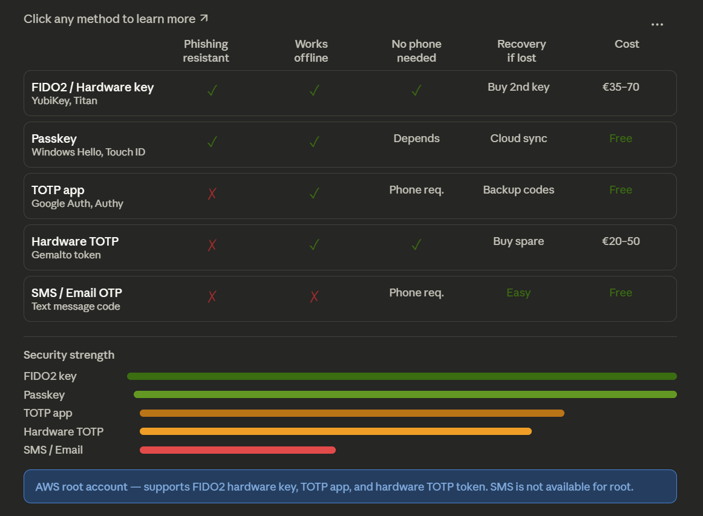

# multi-factor authentication (MFA)  

**Passkeys** and **security keys** 

  
These FIDO-based authenticators use public key cryptography and are resistant to phishing, man-in-the-middle, and replay attacks, providing a stronger level of security than TOTP-based options.

Let me build you a comprehensive visual guide.Here's a full visual breakdown across several diagrams:

Now let's look at how each specific method works:

Now FIDO2 / hardware security keys — which work very differently:

And finally, the full comparison across all methods:Here's a summary of what each method is at its core:

**TOTP** generates a 6-digit code by running a mathematical function on a shared secret + the current time. Both your phone and the server independently do the same math — if the results match, you're in. The code is only valid for 30 seconds. No internet needed. Vulnerable to phishing because a fake site can intercept the code in real time.

**FIDO2 / Hardware security key** uses public-key cryptography. During registration, the key generates a unique key pair per site — the private key never leaves the physical device, ever. At login, the server sends a random challenge, the key signs it with the private key, and the server verifies the signature with the stored public key. Because the key pair is tied to the exact website domain, a fake/phishing site simply gets rejected — the signature won't match.

**Passkeys** work exactly like FIDO2 hardware keys, but the private key is stored in software (your OS or password manager) instead of a physical device. Same cryptographic strength, more convenient, but the key can be backed up/synced unlike a hardware key.

**SMS/Email OTP** is the weakest — the code travels over a network that can be intercepted (SIM swap attacks, SS7 vulnerabilities), and it requires internet connectivity to receive.

For AWS root, the hierarchy from best to acceptable is: **FIDO2 hardware key → TOTP app (KeePassXC) → hardware TOTP token**. SMS is not even an option for root.