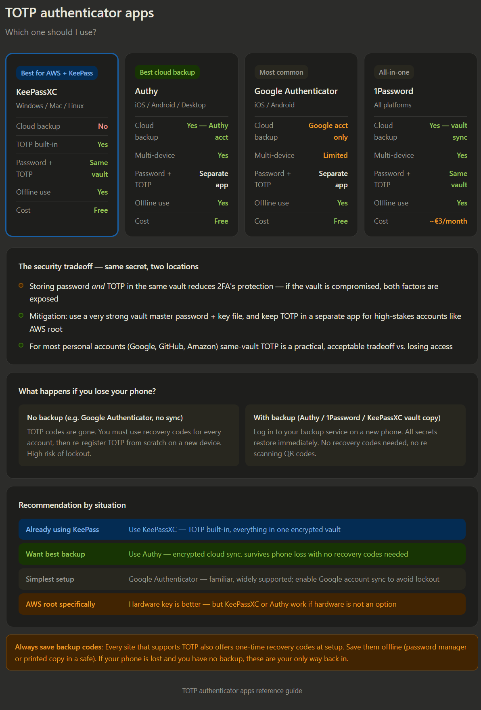

Here's the full breakdown of each option and what makes them different from each other.

---

## The key question: what happens if you lose your phone?

This is the most important factor when choosing a TOTP app, and it splits them into two camps.

**No built-in backup (Google Authenticator default, older apps):** If your phone is stolen or broken, your TOTP codes are gone. You'd have to use recovery codes for every single account, then re-register TOTP from scratch. This used to be a major pain point with Google Authenticator before they added optional Google account sync.

**With cloud backup (Authy, 1Password, KeePassXC with manual backup):** Your TOTP secrets are encrypted and stored in the cloud or your vault. New phone — just log in to your backup service, restore everything in seconds.

---

## How KeePassXC fits into your setup

Since you're already in the KeePass ecosystem, KeePassXC is the natural choice. The workflow for AWS is straightforward: during MFA setup, instead of scanning the QR code with your phone, you click "show secret key", then in KeePassXC right-click your AWS entry → "Set up TOTP" → paste the secret key. From that point forward, KeePassXC generates the 6-digit code right alongside your password in the same entry.

The one thing to be aware of: your TOTP secret is only as safe as your KeePassXC vault. Make sure your vault has a strong master password and that you keep encrypted backups of the `.kdbx` file in at least two places (external drive + cloud storage like encrypted OneDrive or USB).

---

## Why Authy is the strongest phone-based option

Authy stores your TOTP secrets encrypted with your own password in their cloud, independent of your Google or Apple account. This means you can install Authy on a new phone, enter your password, and have all your codes back immediately — no recovery codes needed, no re-scanning QR codes. It also runs on desktop (Windows, Mac), so you're not phone-dependent for generating codes.

The tradeoff is that you're trusting Authy's servers. Their encryption is client-side so they can't see your secrets, but it's still a third-party dependency. For most personal accounts this is a very reasonable tradeoff given how much it reduces lockout risk.

---

## The consolidation warning

The one thing all TOTP apps have in common — even the best ones — is that TOTP codes can be intercepted by a phishing page in real time (unlike hardware FIDO2 keys). This doesn't mean TOTP is bad — it still stops 99% of automated attacks — but it's the reason AWS recommends hardware keys for root specifically. For everything else in your daily life, a good TOTP app is excellent security at zero cost.