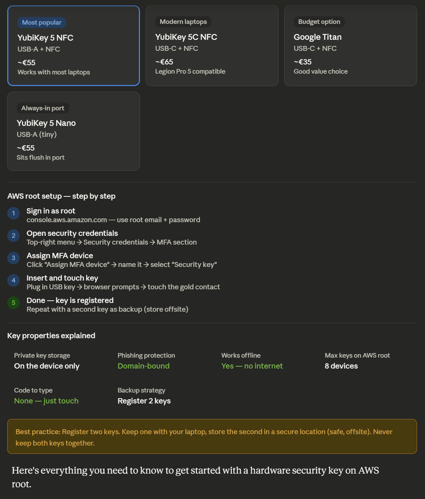

Here's everything you need to know to get started with a hardware security key on AWS root.

---

## What makes FIDO2 special

When you plug in a hardware key and touch it, three things happen that can't be faked remotely:

The key proves **physical presence** — you actually had to touch it. It proves **domain authenticity** — the key was registered at `signin.aws.amazon.com` and will only respond to that exact domain, so a fake site gets nothing useful. And it proves **possession** — without the physical device, the private key simply doesn't exist anywhere else in the world.

This is why FIDO2 is the only MFA method that defeats phishing completely. A TOTP code can be intercepted in real time by a fake login page and replayed within its 30-second window. A FIDO2 signature cannot — it's tied to the specific domain challenge and is cryptographically one-time-use.

---

## Which key to buy for your setup

Given you have a Lenovo Legion Pro 5 (USB-C laptop), the **YubiKey 5C NFC** is the best fit — USB-C plugs directly in, and NFC means you can also authenticate from an Android phone by tapping the key to it. The **YubiKey 5 NFC** (USB-A) works fine too with a USB-A port or adapter.

Buy two. The second one is your emergency backup — register it on AWS immediately after the first, then store it somewhere physically separate from your laptop.

---

## Logging in day-to-day

Once set up, signing into AWS root looks like this: enter your root email and password as usual, then when AWS prompts for MFA, you just insert the key and touch the gold contact. No code to read, no app to open, no 30-second window to race against. The whole second-factor step takes about two seconds.

---

## One thing to be aware of

The hardware key is your only path to root MFA if it's your sole registered device. If you lose it before registering a backup, account recovery through AWS Support is possible but slow and requires proving ownership. This is the strongest argument for registering that second key right away — it takes about five minutes and eliminates the risk entirely.